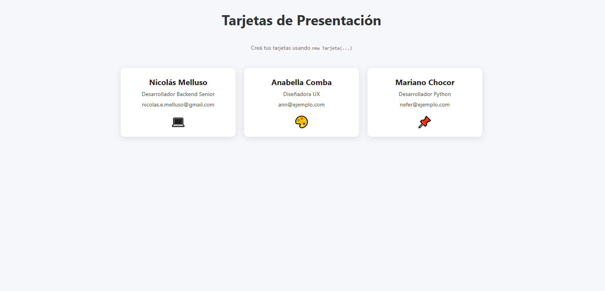

# DESCRIPCION

Ahora vamos a trabajar sobre las clases, la programación orientada a objetos trabaja mucho sobre la realidad y es necesario tener un orden
POO (Programacion Orientada a Objetos) o OOP en Ingles nos permite trabajar con herencia, polimorfismo, encapsulación entre otras.

## OBJETIVO

Mostrar en pantalla las tarjetas tal cual invocando la creación de las tarjetas mediante las clases ya existentes. 

# Ayudas

• Acá están los iconos que se muestran: 💻🎨📌
• En main.js hay que crear el código para que funcione
• Denle una revisada a Tarjeta.js luego a Diseñador.js y luego a Animador.js en ese orden

# TEST TEORIA

1. ¿Qué es la programación orientada a objetos?
2. ¿Qué es el encapsulamiento?
3. ¿Qué es la herencia?
4. ¿Qué es el polimorfismo?
5. ¿Qué es la abstracción?
6. ¿Cómo se importa una clase?

1.La programación orientada a objetos (POO) es un paradigma de programación que organiza el código en torno a objetos, en lugar de funciones o lógica suelta. Cada objeto es una instancia que combina:
Atributos (propiedades): datos o características del objeto.
Métodos (funciones): comportamientos o acciones que el objeto puede realizar.
Este enfoque se basa en representar entidades del mundo real dentro del código, haciendo que el software sea más modular, reutilizable y fácil de mantener.
Clase: Es como un molde o plantilla que define cómo serán los objetos.
Objeto: Es una instancia creada a partir de la clase.

2.Encapsulamiento
Ocultar detalles internos y exponer solo lo necesario mediante métodos.
Protege la integridad de los datos.

3.Herencia
Permite que una clase herede atributos y métodos de otra.

4.Polimorfismo
Métodos con el mismo nombre pero comportamiento diferente según la clase.

5.Abstracción
Simplifica la complejidad mostrando solo lo esencial al usuario.

6.
Usando CommonJS
// main.js
const Persona = require('./Persona');
const persona3 = new Persona('Lucía', 28);
persona3.saludar(); // Hola, soy Lucía

Usando export default
// main.js
import Persona from './Persona.js'; // No hace falta llaves {}
const persona2 = new Persona('Carlos', 25);
persona2.saludar(); // Hola, soy Carlos

Usando ES Modules
// main.js
import { Persona } from './Persona.js'; // Importa la clase
const persona1 = new Persona('Anabella', 30);
persona1.saludar(); // Hola, soy Anabella y tengo 30 años.
